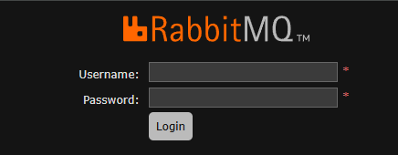
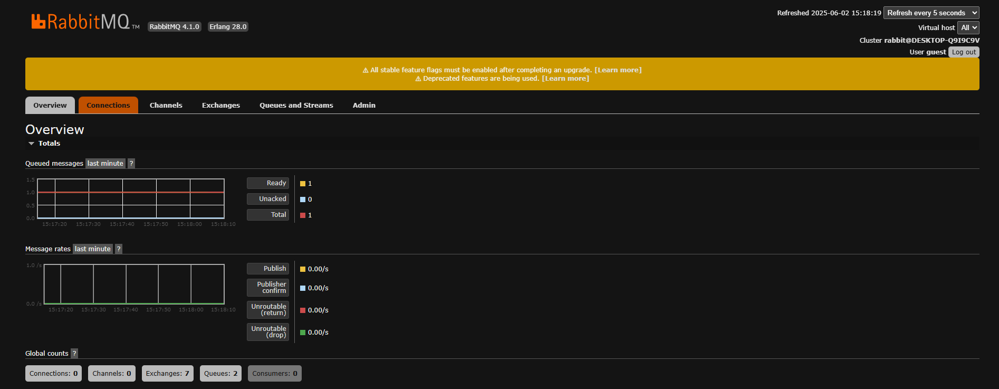
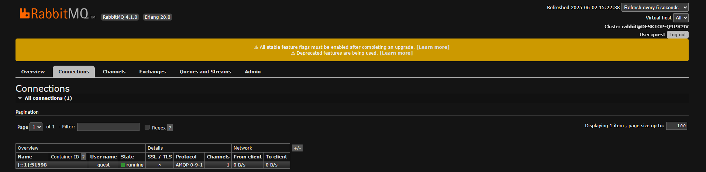
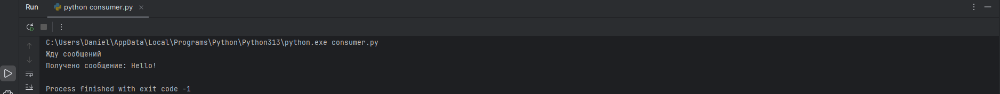
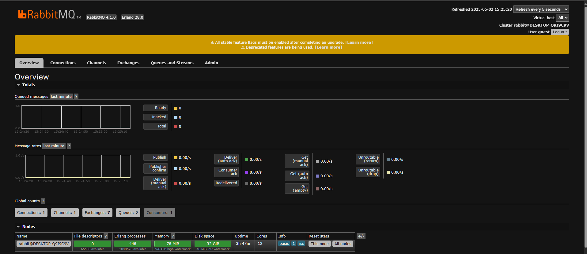

# RabbitMQ Message Sender and Receiver


## Описание

Этот проект предоставляет два скрипта на Python для отправки и получения сообщений с использованием RabbitMQ. RabbitMQ — это популярный брокер сообщений, который позволяет обмениваться сообщениями между различными приложениями.

## Установка и настройка
1. Убедитесь, что у вас установлен Python версии 3.6 или выше.
2. Установите RabbitMQ на вашем компьютере. Вы можете скачать его с [официального сайта RabbitMQ](https://www.rabbitmq.com/download.html).
3. Запустите cmd и перейдите по пути (../../Program Files/Rabbit MQServer/rabbitmq_server-<версия сервера>/sbin
4. Выполните следующие команды для запуска сервера:
rabbitmq-plugins enable rabbitmq_management  
rabbitmq-service stop  
rabbitmq-service start  
5. Проверьте запустился ли сервер перейдя по адресу http://localhost:15672 в браузере. Если сервер запустился, то 
появится доступ к веб-интерфейсу. (по умолчанию username = guest, password = guest)


6. Клонируйте репозиторий на ваш локальный компьютер.
7. Перейдите в директорию проекта.
8. Установите необходимые зависимости с помощью pip:
```bash
pip install pika
```

## Сценарий использования
1. Запустите RabbitMQ.
2. Запустите через терминал файл producer.py
```bash
python producer.py
```
3. Зайдя в веб-интерфейс RabbitMQ увидим что сообщение поставлено в очередь.


4. Запустите через другой терминал файл consumer.py
```bash
python consumer.py
```
5. Увидим что появилось новое подключение на вкладке "Connections" 

6. Сообщение обработалось, вывелось в терминале и ушло из очереди.

